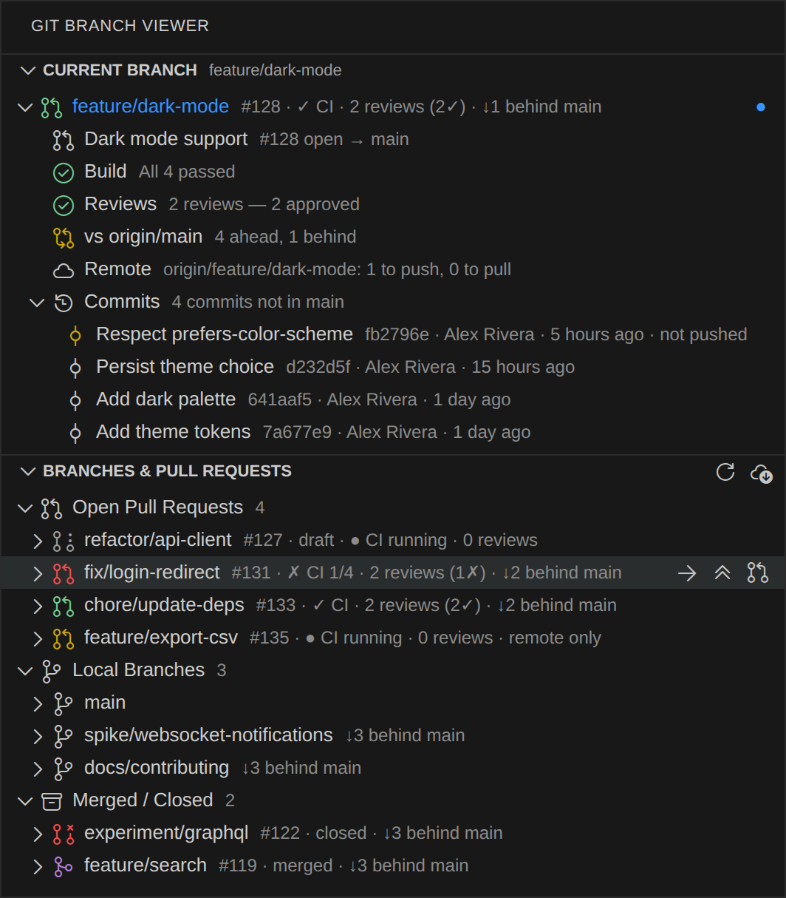
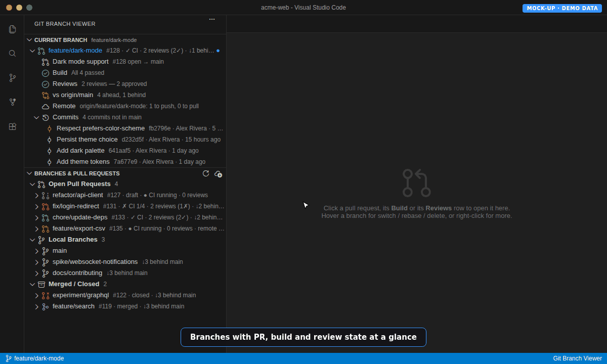
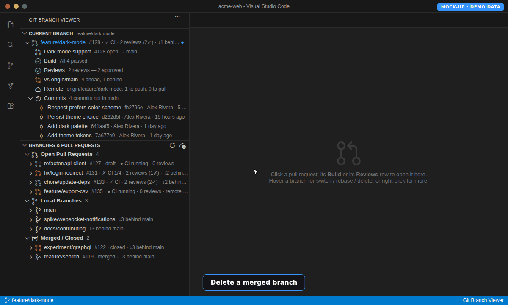
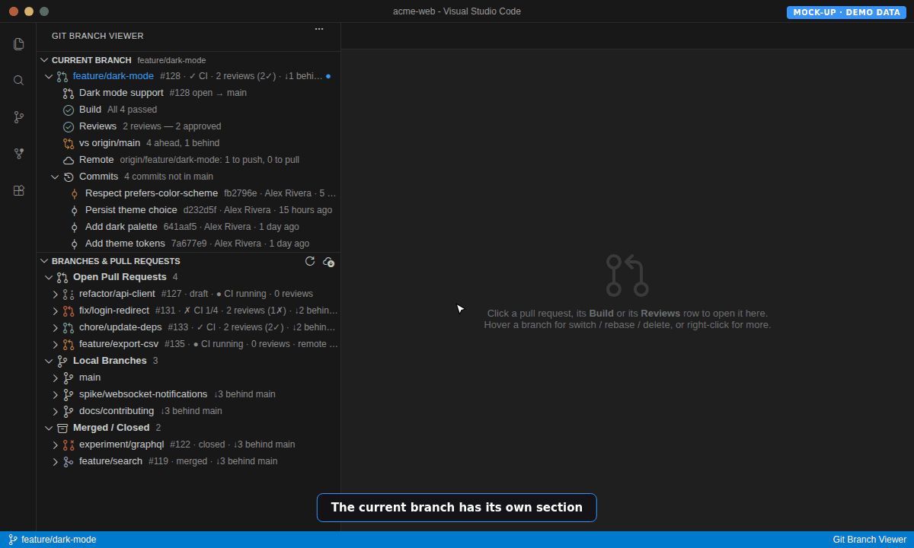
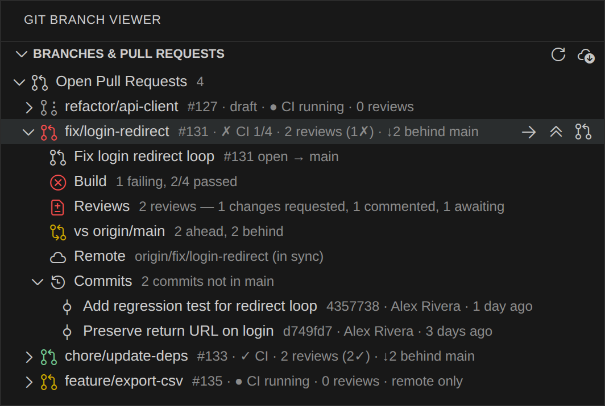
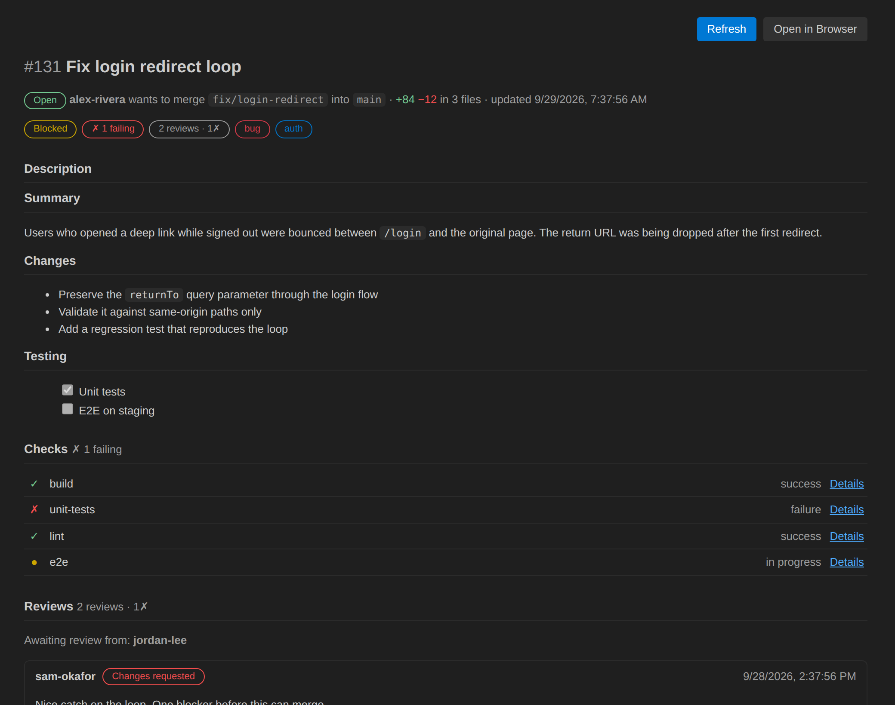
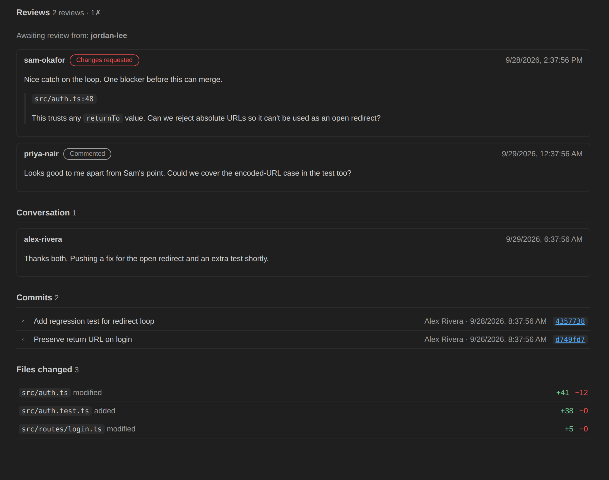

# Git Branch Viewer

A sidebar for the branches in your repository, with the pull request, build state and review count for each one, plus one-click **switch** and **rebase onto main**.

Part of the CodeMaman extension family, alongside [AI Co-Authoring Tracker](https://github.com/0xC0DEM4M4N/vscode-extension-ai-coauthoring-tracker).

## What you see

Open the **Git Branch Viewer** icon in the activity bar. It has two collapsible sections:

- **Current Branch** shows the branch you are on, highlighted in blue with a badge, and its name sits next to the section title so you can see it even when the section is collapsed. It opens with the pull request, build, reviews, comparison with main, remote status and the full list of commits, with anything not yet pushed marked.
- **Branches & Pull Requests** lists every other branch, grouped as **Open Pull Requests** (including your own open PRs that are not checked out locally), **Local Branches** (no pull request) and **Merged / Closed** (branches whose PR is finished, handy for spotting clean-up candidates).



*Screenshots in this README are illustrative renderings of the extension's output for a demo repository.*

## See it in action

**Browse pull requests.** Expand a branch, then click Reviews or Build to open the pull request inside VS Code.



**Rebase onto main.** Hover a branch, click rebase and confirm. The extension fetches, then rebases with `--autostash`.


**Delete a branch.** Right-click, choose Delete Branch…, then delete locally or locally and on origin.



**Current branch.** It has its own section, and its name stays beside the title when you collapse it.



*Animations are recorded from an interactive mock-up using demo data.*

Each branch row shows, at a glance: `#PR · ✓ CI · 2 reviews (2✓) · ↓3 behind main`.

Expand a branch for the detail: PR title and target, build status (with failing check names on hover), review breakdown (approved, changes requested, commented, awaiting), how far it is ahead/behind main and its remote tracking state. Click the PR, build or review row to open the pull request **inside VS Code**, scrolled to that section.



### Pull request panel

The panel opens as an editor tab and shows the description, checks (with links to each run), every review with its inline comments, who is still awaiting review, the conversation, commits and changed files, plus a merge-readiness badge. Use **Refresh** to re-fetch it, or **Open in Browser** if you would rather see it on GitHub. Nothing is embedded from github.com: the data comes from the `gh` CLI and is rendered locally with scripts disabled.





### Commits

Every branch has a **Commits** node listing the commits on that branch that are not on main (or recent history for main itself and fully merged branches). Each commit shows its short hash, author and age. Commits not yet pushed are highlighted, merge commits get a merge icon, and clicking a commit opens its diff in a VS Code editor tab (generated locally with `git show`). Right-click to copy the hash or open it on GitHub. Long histories load in batches (`gitBranchViewer.commitsPageSize`, default 100) with a **Show more** entry.

## Actions

Inline buttons and the right-click menu on a branch:

- **Switch to Branch.** Uses `git switch`. For a PR branch that is not checked out locally it uses `gh pr checkout`.
- **Rebase Onto Main.** Fetches `origin`, shows how far behind the branch is, asks for confirmation, then rebases onto `origin/main` (or `master`, or your configured base). Uncommitted changes on the current branch are auto-stashed. On conflicts you are told, and can jump to Source Control or abort. After rewriting a pushed branch you are offered a `--force-with-lease` push.
- **Delete Branch.** Select one or several branches (Cmd/Ctrl-click) and choose **Delete Local** or **Delete Local and Origin**. The confirmation lists each branch with its PR state and any commits that would be lost (not pushed, or never pushed), and warns when deleting the remote branch will close an open PR. The current branch and the base branch are protected. If git refuses because a branch is "not fully merged" (common after squash merges) you are asked before it is force-deleted. Branches with a merged or closed PR get a trash button inline.
- **Show Pull Request** (in VS Code), **Open Pull Request in Browser**, **Create Pull Request** (runs `gh pr create --web` in a terminal) and **Copy Branch Name**.

The view refreshes instantly on any git change (checkout, commit, fetch, rebase) and re-fetches GitHub data every couple of minutes while visible. Use the toolbar buttons to refresh or to fetch from the remote.

## Requirements

- [GitHub CLI](https://cli.github.com) (`gh`), signed in with `gh auth login`. Without it, local branches still work; PR, build and review info is simply unavailable and the view tells you why.
- Git 2.23 or newer.

## Settings

| Setting | Default | Description |
| --- | --- | --- |
| `gitBranchViewer.baseBranch` | *(auto)* | Branch to rebase onto. Empty auto-detects from `origin/HEAD`, then `main`/`master`. |
| `gitBranchViewer.refreshIntervalSeconds` | `120` | How often GitHub data is re-fetched while the view is visible. |
| `gitBranchViewer.showRemoteOnlyPrs` | `true` | List your open PRs that have no local branch. |
| `gitBranchViewer.commitsPageSize` | `100` | Commits loaded at a time under a branch's Commits node. |

## Development

```sh
npm install
npm run build          # compile
npm run build-install  # compile + package a .vsix into install/
```

Press F5 to launch an Extension Development Host.
